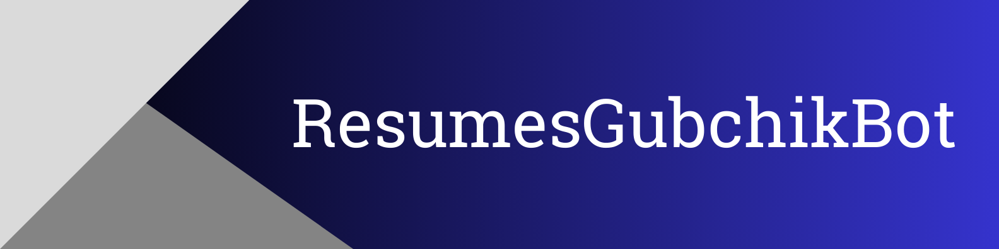

_The telegram bot to find resumes from popular work sites._

## Demo

Click [here](https://t.me/ResumesGubchikBot) to open the telegram ResumesGubchikBot.

## Project Modules

<a href='https://pypi.org/project/aiogram'></a> <a href='https://pypi.org/project/beautifulsoup4'></a> <a href='https://pypi.org/project/lxml'></a> <a href='https://pypi.org/project/python-dotenv'></a> <a href='https://pypi.org/project/requests'></a> <a href='https://pypi.org/project/user-agent'></a> 

> Look at the `requirements.txt` file for more details.

## Features

- **Resume Parsing**: Parse resumes from the following websites: work.ua
- **Sort Candidates by Relevance**: Once resumes have been parsed, sort them by their relevanse.
- **Telegram Bot Interface**

## Environment Variables

To run this project, you should add the following environment variables:

`BOT_TOKEN`
`ADMINS`

> Look at the .env.sample

## Getting Started

To get started with the project, follow these steps:

1. Clone the repository:
    ```bash
    git clone https://github.com/Gubchik123/robomate-tesk-task.git
    ```

2. Go to the project directory:

    ```bash
    cd robomate-tesk-task
    ```
    
3. Install the required dependencies:
    ```bash
    pip install -r requirements.txt
    ```

4. Create a `.env` file and add the environment variables.

5. Run the bot:
    ```bash
    python bot
    ```